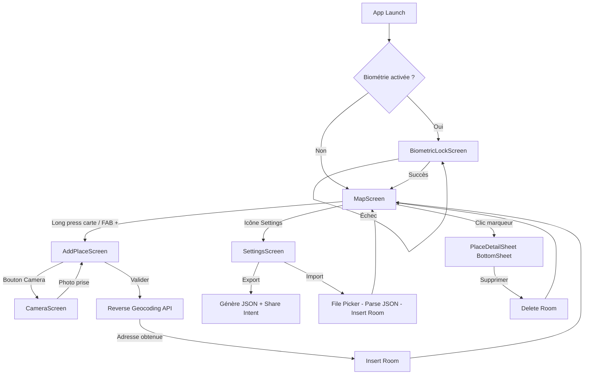

# My Places – Plan d'Architecture Exhaustif

Application Android native – Journal intime géographique.
**Technologies imposées** : Kotlin, Android Studio, Jetpack Compose, Room, Retrofit, Google Maps SDK.

> **⚠️ IMPORTANT**
> Ce plan est conçu pour être exécuté par un agent IA développeur. Les tâches nécessitant une intervention humaine sont clairement marquées avec le tag **🧑 HUMAIN**.

---

## 1. Configuration du Projet Android Studio

### 1.1 Paramètres du projet

| Paramètre | Valeur |
|---|---|
| Nom | My Places |
| Package | `com.myplaces.app` |
| Langage | Kotlin |
| Min SDK | API 26 (Android 8.0) |
| Target SDK | API 35 |
| Build system | Gradle Kotlin DSL (`.kts`) |
| Template | Empty Compose Activity |

### 1.2 Fichier `.gitignore`

Créer un `.gitignore` à la racine du projet avec le contenu suivant :

```gitignore
# Built application files
*.apk
*.aar
*.ap_
*.aab

# Files for the ART/Dalvik VM
*.dex

# Java class files
*.class

# Generated files
bin/
gen/
out/
build/

# Gradle files
.gradle/
build/

# Local configuration file (sdk path, API keys)
local.properties

# Proguard folder
proguard/

# Log Files
*.log

# Android Studio Navigation editor temp files
.navigation/

# Android Studio captures folder
captures/

# IntelliJ
*.iml
.idea/
.idea/workspace.xml
.idea/tasks.xml
.idea/gradle.xml
.idea/assetWizardSettings.xml
.idea/dictionaries
.idea/libraries
.idea/caches
.idea/modules.xml
.idea/misc.xml
.idea/vcs.xml
.idea/jarRepositories.xml
.idea/compiler.xml

# Keystore files
*.jks
*.keystore

# External native build folder generated in Android Studio 2.2 and later
.cxx/

# Google Services (si utilisé)
google-services.json

# Secrets / clés API
secrets.properties

# OS generated files
.DS_Store
.DS_Store?
._*
.Spotlight-V100
.Trashes
ehthumbs.db
Thumbs.db

# Crash reports
crashlytics-build.properties
```

---

## 2. Dépendances Complètes

### 2.1 `gradle/libs.versions.toml` (Version Catalog)

Utiliser le Version Catalog de Gradle pour centraliser toutes les versions.

```toml
[versions]
agp = "8.7.3"
kotlin = "2.1.0"
ksp = "2.1.0-1.0.29"
coreKtx = "1.15.0"
lifecycleRuntimeKtx = "2.8.7"
activityCompose = "1.9.3"
composeBom = "2024.12.01"
navigationCompose = "2.8.5"

# Room
room = "2.6.1"

# Retrofit
retrofit = "2.11.0"
gson = "2.11.0"

# Google Maps
mapsCompose = "6.2.1"
playServicesMaps = "19.0.0"
playServicesLocation = "21.3.0"

# CameraX
cameraX = "1.4.1"

# Biometric
biometric = "1.2.0-alpha05"

# DataStore
datastore = "1.1.1"

# Coil (image loading)
coil = "2.7.0"

# Accompanist (permissions)
accompanist = "0.36.0"

[libraries]
# Core Android
androidx-core-ktx = { group = "androidx.core", name = "core-ktx", version.ref = "coreKtx" }
androidx-lifecycle-runtime-ktx = { group = "androidx.lifecycle", name = "lifecycle-runtime-ktx", version.ref = "lifecycleRuntimeKtx" }
androidx-lifecycle-viewmodel-compose = { group = "androidx.lifecycle", name = "lifecycle-viewmodel-compose", version.ref = "lifecycleRuntimeKtx" }
androidx-activity-compose = { group = "androidx.activity", name = "activity-compose", version.ref = "activityCompose" }

# Compose BOM
androidx-compose-bom = { group = "androidx.compose", name = "compose-bom", version.ref = "composeBom" }
androidx-ui = { group = "androidx.compose.ui", name = "ui" }
androidx-ui-graphics = { group = "androidx.compose.ui", name = "ui-graphics" }
androidx-ui-tooling = { group = "androidx.compose.ui", name = "ui-tooling" }
androidx-ui-tooling-preview = { group = "androidx.compose.ui", name = "ui-tooling-preview" }
androidx-material3 = { group = "androidx.compose.material3", name = "material3" }
androidx-material-icons-extended = { group = "androidx.compose.material", name = "material-icons-extended" }

# Navigation Compose
androidx-navigation-compose = { group = "androidx.navigation", name = "navigation-compose", version.ref = "navigationCompose" }

# Room
androidx-room-runtime = { group = "androidx.room", name = "room-runtime", version.ref = "room" }
androidx-room-ktx = { group = "androidx.room", name = "room-ktx", version.ref = "room" }
androidx-room-compiler = { group = "androidx.room", name = "room-compiler", version.ref = "room" }

# Retrofit + Gson
squareup-retrofit2 = { group = "com.squareup.retrofit2", name = "retrofit", version.ref = "retrofit" }
squareup-retrofit2-converter-gson = { group = "com.squareup.retrofit2", name = "converter-gson", version.ref = "retrofit" }
google-gson = { group = "com.google.code.gson", name = "gson", version.ref = "gson" }

# Google Maps
google-maps-compose = { group = "com.google.maps.android", name = "maps-compose", version.ref = "mapsCompose" }
google-play-services-maps = { group = "com.google.android.gms", name = "play-services-maps", version.ref = "playServicesMaps" }
google-play-services-location = { group = "com.google.android.gms", name = "play-services-location", version.ref = "playServicesLocation" }

# CameraX
androidx-camera-core = { group = "androidx.camera", name = "camera-core", version.ref = "cameraX" }
androidx-camera-camera2 = { group = "androidx.camera", name = "camera-camera2", version.ref = "cameraX" }
androidx-camera-lifecycle = { group = "androidx.camera", name = "camera-lifecycle", version.ref = "cameraX" }
androidx-camera-view = { group = "androidx.camera", name = "camera-view", version.ref = "cameraX" }

# Biometric
androidx-biometric = { group = "androidx.biometric", name = "biometric", version.ref = "biometric" }

# DataStore Preferences
androidx-datastore-preferences = { group = "androidx.datastore", name = "datastore-preferences", version.ref = "datastore" }

# Coil (image loading for Compose)
coil-compose = { group = "io.coil-kt", name = "coil-compose", version.ref = "coil" }

# Accompanist Permissions
accompanist-permissions = { group = "com.google.accompanist", name = "accompanist-permissions", version.ref = "accompanist" }

[plugins]
android-application = { id = "com.android.application", version.ref = "agp" }
kotlin-android = { id = "org.jetbrains.kotlin.android", version.ref = "kotlin" }
kotlin-compose = { id = "org.jetbrains.kotlin.plugin.compose", version.ref = "kotlin" }
ksp = { id = "com.google.devtools.ksp", version.ref = "ksp" }
```

### 2.2 `build.gradle.kts` (Module :app)

```kotlin
plugins {
    alias(libs.plugins.android.application)
    alias(libs.plugins.kotlin.android)
    alias(libs.plugins.kotlin.compose)
    alias(libs.plugins.ksp)
}

android {
    namespace = "com.myplaces.app"
    compileSdk = 35

    defaultConfig {
        applicationId = "com.myplaces.app"
        minSdk = 26
        targetSdk = 35
        versionCode = 1
        versionName = "1.0"
    }

    buildFeatures {
        compose = true
    }
}

dependencies {
    // Core
    implementation(libs.androidx.core.ktx)
    implementation(libs.androidx.lifecycle.runtime.ktx)
    implementation(libs.androidx.lifecycle.viewmodel.compose)
    implementation(libs.androidx.activity.compose)

    // Compose
    implementation(platform(libs.androidx.compose.bom))
    implementation(libs.androidx.ui)
    implementation(libs.androidx.ui.graphics)
    implementation(libs.androidx.ui.tooling.preview)
    implementation(libs.androidx.material3)
    implementation(libs.androidx.material.icons.extended)
    debugImplementation(libs.androidx.ui.tooling)

    // Navigation
    implementation(libs.androidx.navigation.compose)

    // Room
    implementation(libs.androidx.room.runtime)
    implementation(libs.androidx.room.ktx)
    ksp(libs.androidx.room.compiler)

    // Retrofit + Gson
    implementation(libs.squareup.retrofit2)
    implementation(libs.squareup.retrofit2.converter.gson)
    implementation(libs.google.gson)

    // Google Maps
    implementation(libs.google.maps.compose)
    implementation(libs.google.play.services.maps)
    implementation(libs.google.play.services.location)

    // CameraX
    implementation(libs.androidx.camera.core)
    implementation(libs.androidx.camera.camera2)
    implementation(libs.androidx.camera.lifecycle)
    implementation(libs.androidx.camera.view)

    // Biometric
    implementation(libs.androidx.biometric)

    // DataStore
    implementation(libs.androidx.datastore.preferences)

    // Coil
    implementation(libs.coil.compose)

    // Accompanist Permissions
    implementation(libs.accompanist.permissions)
}
```

### 2.3 Permissions AndroidManifest.xml

```xml
<uses-permission android:name="android.permission.ACCESS_FINE_LOCATION" />
<uses-permission android:name="android.permission.ACCESS_COARSE_LOCATION" />
<uses-permission android:name="android.permission.CAMERA" />
<uses-permission android:name="android.permission.READ_EXTERNAL_STORAGE"
    android:maxSdkVersion="32" />
<uses-permission android:name="android.permission.READ_MEDIA_IMAGES" />
<uses-permission android:name="android.permission.INTERNET" />

<uses-feature android:name="android.hardware.camera" android:required="false" />
<uses-feature android:name="android.hardware.location.gps" android:required="false" />
```

> **🧑 HUMAIN – Clé API Google Maps**
>
> Ajouter la clé API Google Maps dans le `AndroidManifest.xml` :
> ```xml
> <meta-data
>     android:name="com.google.android.geo.API_KEY"
>     android:value="VOTRE_CLE_API_ICI" />
> ```
> Pour obtenir la clé :
> 1. Aller sur [Google Cloud Console](https://console.cloud.google.com/)
> 2. Créer un projet ou en sélectionner un existant
> 3. Activer l'API **Maps SDK for Android**
> 4. Créer une clé API dans **Identifiants**
> 5. Restreindre la clé à votre package `com.myplaces.app` et au SHA-1 de votre keystore de debug

---

## 3. Architecture du Code (MVVM)

### 3.1 Arborescence des packages

```
com.myplaces.app/
│
├── MyPlacesApplication.kt          ← Application class (instancie la DB + le Repository)
├── MainActivity.kt                 ← Unique Activity, héberge le NavHost Compose
│
├── data/
│   ├── local/
│   │   ├── entity/
│   │   │   └── PlaceEntity.kt      ← @Entity Room
│   │   ├── dao/
│   │   │   └── PlaceDao.kt         ← @Dao Room (CRUD + requêtes)
│   │   └── AppDatabase.kt          ← @Database Room (singleton)
│   │
│   ├── remote/
│   │   ├── api/
│   │   │   └── GeocodingApiService.kt  ← Interface Retrofit pour api-adresse.data.gouv.fr
│   │   └── model/
│   │       └── GeocodingResponse.kt    ← Data classes pour la réponse JSON de l'API
│   │
│   └── repository/
│       └── PlaceRepository.kt      ← Source unique de vérité (Room + Retrofit)
│
├── ui/
│   ├── navigation/
│   │   ├── NavGraph.kt             ← NavHost + définition des routes
│   │   └── Screen.kt               ← Sealed class des routes (enum de navigation)
│   │
│   ├── biometric/
│   │   └── BiometricLockScreen.kt  ← Écran de verrouillage biométrique
│   │
│   ├── map/
│   │   ├── MapScreen.kt            ← Écran principal avec Google Maps
│   │   └── MapViewModel.kt         ← ViewModel pour la carte
│   │
│   ├── addplace/
│   │   ├── AddPlaceScreen.kt       ← Formulaire d'ajout de lieu
│   │   └── AddPlaceViewModel.kt    ← ViewModel pour le formulaire
│   │
│   ├── camera/
│   │   └── CameraScreen.kt         ← Écran capture photo CameraX
│   │
│   ├── settings/
│   │   ├── SettingsScreen.kt       ← Paramètres (biométrie, import/export)
│   │   └── SettingsViewModel.kt    ← ViewModel pour les paramètres
│   │
│   └── components/
│       ├── EmojiPicker.kt          ← Composable sélecteur d'émojis
│       ├── PlaceDetailSheet.kt     ← ModalBottomSheet détail d'un lieu
│       └── PlaceMarker.kt          ← Composable marqueur custom avec émoji
│
├── util/
│   ├── FileUtils.kt               ← Sauvegarde/suppression photos dans le stockage interne
│   ├── JsonExporter.kt            ← Sérialisation du journal → places_export.json
│   ├── JsonImporter.kt            ← Désérialisation JSON → insertion Room
│   └── BiometricHelper.kt        ← Wrapper autour de BiometricPrompt
│
└── di/
    └── AppContainer.kt            ← Injection de dépendances manuelle (pas de Hilt)
```

### 3.2 Justification : pas de Hilt

On n'utilise **pas Hilt** pour simplifier le projet. L'injection de dépendances est gérée manuellement via un `AppContainer` instancié dans `MyPlacesApplication`. Les ViewModels récupèrent le container via `LocalContext` → `applicationContext`.

---

## 4. Schéma de Base de Données Room

### 4.1 Entity `PlaceEntity`

```kotlin
@Entity(tableName = "places")
data class PlaceEntity(
    @PrimaryKey(autoGenerate = true)
    val id: Long = 0,

    @ColumnInfo(name = "title")
    val title: String,

    @ColumnInfo(name = "description")
    val description: String,

    @ColumnInfo(name = "latitude")
    val latitude: Double,

    @ColumnInfo(name = "longitude")
    val longitude: Double,

    @ColumnInfo(name = "address")
    val address: String? = null,        // Rempli par le reverse geocoding

    @ColumnInfo(name = "emoji")
    val emoji: String,                  // Caractère emoji (ex: "😀")

    @ColumnInfo(name = "photo_path")
    val photoPath: String? = null,      // Chemin fichier interne (PAS de Base64)

    @ColumnInfo(name = "author_id")
    val authorId: String,               // UUID unique par utilisateur

    @ColumnInfo(name = "author_name")
    val authorName: String,             // "Moi" par défaut, ou nom de l'ami

    @ColumnInfo(name = "created_at")
    val createdAt: Long,                // System.currentTimeMillis()

    @ColumnInfo(name = "is_imported")
    val isImported: Boolean = false     // true = lieu importé d'un ami
)
```

### 4.2 DAO `PlaceDao`

```kotlin
@Dao
interface PlaceDao {

    // === LECTURE ===

    @Query("SELECT * FROM places ORDER BY created_at DESC")
    fun getAllPlaces(): Flow<List<PlaceEntity>>

    @Query("SELECT * FROM places WHERE is_imported = 0 ORDER BY created_at DESC")
    fun getMyPlaces(): Flow<List<PlaceEntity>>

    @Query("SELECT * FROM places WHERE is_imported = 1 ORDER BY created_at DESC")
    fun getImportedPlaces(): Flow<List<PlaceEntity>>

    @Query("SELECT * FROM places WHERE id = :placeId")
    suspend fun getPlaceById(placeId: Long): PlaceEntity?

    // === ÉCRITURE ===

    @Insert(onConflict = OnConflictStrategy.REPLACE)
    suspend fun insertPlace(place: PlaceEntity): Long

    @Insert(onConflict = OnConflictStrategy.IGNORE)
    suspend fun insertPlaces(places: List<PlaceEntity>)

    @Update
    suspend fun updatePlace(place: PlaceEntity)

    @Delete
    suspend fun deletePlace(place: PlaceEntity)

    @Query("DELETE FROM places WHERE id = :placeId")
    suspend fun deletePlaceById(placeId: Long)

    // === EXPORT ===

    @Query("SELECT * FROM places WHERE is_imported = 0")
    suspend fun getAllMyPlacesForExport(): List<PlaceEntity>

    // === IMPORT (anti-doublon basé sur authorId + createdAt) ===

    @Query("SELECT COUNT(*) FROM places WHERE author_id = :authorId AND created_at = :createdAt")
    suspend fun placeExists(authorId: String, createdAt: Long): Int
}
```

### 4.3 Database `AppDatabase`

```kotlin
@Database(entities = [PlaceEntity::class], version = 1, exportSchema = false)
abstract class AppDatabase : RoomDatabase() {
    abstract fun placeDao(): PlaceDao
}
```

### 4.4 Stratégie anti-collision pour l'Import

Lors de l'import d'un fichier JSON :
1. Pour chaque lieu du fichier, vérifier via `placeExists(authorId, createdAt)` s'il existe déjà.
2. Si `count == 0` → insérer avec `isImported = true`.
3. Si `count > 0` → ignorer (pas de doublon).

Cette logique est dans `PlaceRepository.importPlaces()`.

---

## 5. API REST – Reverse Geocoding

### 5.1 API utilisée : `api-adresse.data.gouv.fr`

**Endpoint** : `GET https://api-adresse.data.gouv.fr/reverse/?lon={lng}&lat={lat}`

> **⚠️ ATTENTION**
> Cette API ne couvre que la **France métropolitaine et les DOM-TOM**. Pour des coordonnées hors France, la réponse sera vide. Aucun fallback n'est implémenté (pas demandé dans le cahier des charges).

### 5.2 Interface Retrofit

```kotlin
interface GeocodingApiService {

    @GET("reverse/")
    suspend fun reverseGeocode(
        @Query("lon") longitude: Double,
        @Query("lat") latitude: Double
    ): GeocodingResponse

    companion object {
        const val BASE_URL = "https://api-adresse.data.gouv.fr/"
    }
}
```

### 5.3 Modèles de réponse

```kotlin
data class GeocodingResponse(
    val features: List<Feature>
)

data class Feature(
    val properties: Properties
)

data class Properties(
    val label: String?,       // "12 Rue de Rivoli 75001 Paris"
    val housenumber: String?,
    val street: String?,
    val postcode: String?,
    val city: String?,
    val context: String?      // "75, Paris, Île-de-France"
)
```

### 5.4 Appel dans le Repository

```kotlin
suspend fun resolveAddress(lat: Double, lng: Double): String? {
    return try {
        val response = geocodingApi.reverseGeocode(longitude = lng, latitude = lat)
        response.features.firstOrNull()?.properties?.label
    } catch (e: Exception) {
        null  // En cas d'erreur réseau, on stocke null (pas bloquant)
    }
}
```

---

## 6. Écrans & Navigation

### 6.1 Architecture : Single Activity + NavHost

**1 seule `MainActivity`** héberge un `NavHost` Compose. Pas de fragments, pas de multi-activity.

### 6.2 Définition des routes

```kotlin
sealed class Screen(val route: String) {
    object Map : Screen("map")
    object AddPlace : Screen("add_place/{lat}/{lng}") {
        fun createRoute(lat: Double, lng: Double) = "add_place/$lat/$lng"
    }
    object Camera : Screen("camera")
    object Settings : Screen("settings")
}
```

### 6.3 Tableau des écrans

| # | Écran | Route | Composable | ViewModel | Description |
|---|---|---|---|---|---|
| 1 | **Biometric Lock** | Pas de route (affiché conditionnellement avant le NavHost) | `BiometricLockScreen` | — | Prompt `BiometricPrompt`. Si succès → affiche le NavHost. Si biométrie désactivée → skip. |
| 2 | **Carte (principal)** | `map` | `MapScreen` | `MapViewModel` | Google Maps plein écran. Marqueurs avec émojis. FAB "+" pour ajouter. Long press sur la carte pour ajouter. Icône settings en TopBar. `ModalBottomSheet` pour le détail au clic marqueur. |
| 3 | **Détail lieu** | Pas de route (ModalBottomSheet dans MapScreen) | `PlaceDetailSheet` | — | Titre, date formatée, adresse, emoji, photo, description. Bouton supprimer. |
| 4 | **Ajout lieu** | `add_place/{lat}/{lng}` | `AddPlaceScreen` | `AddPlaceViewModel` | Formulaire : titre (TextField), description (TextField multiline), EmojiPicker, bouton photo (navigue vers Camera ou ouvre galerie). Bouton valider → reverse geocoding + insert Room. |
| 5 | **Caméra** | `camera` | `CameraScreen` | — | Preview CameraX plein écran. Bouton capture. Retourne le chemin de la photo via `savedStateHandle` au retour. |
| 6 | **Paramètres** | `settings` | `SettingsScreen` | `SettingsViewModel` | Switch biométrie ON/OFF (DataStore). Bouton "Exporter mon journal" → génère `places_export.json` et ouvre le share intent. Bouton "Importer un journal" → ouvre le file picker, lit le JSON, importe dans Room. |

### 6.4 Flux de navigation (diagramme)



---

## 7. Gestion des Photos

### 7.1 Règles strictes

> **🚨 INTERDIT** de stocker les photos en Base64 dans Room. Seul le **chemin fichier** (`String`) est stocké.

### 7.2 Flux de capture (CameraX)

1. L'utilisateur clique sur "Prendre une photo" dans `AddPlaceScreen`.
2. Navigation vers `CameraScreen` (CameraX).
3. Au déclenchement, la photo est sauvegardée dans le **stockage interne privé** de l'app :
   ```
   context.filesDir/photos/photo_{timestamp}.jpg
   ```
4. Le chemin absolu est retourné à `AddPlaceScreen` via `savedStateHandle`.
5. Ce chemin est stocké dans `PlaceEntity.photoPath`.

### 7.3 Flux galerie (alternative)

1. L'utilisateur clique sur "Choisir depuis la galerie".
2. Un `ActivityResultContract` (`GetContent`) ouvre le sélecteur d'images.
3. L'URI retournée est **copiée** dans le stockage interne privé (pour garantir la pérennité).
4. Le chemin de la copie est stocké dans Room.

### 7.4 Affichage

Utiliser **Coil** (`AsyncImage`) pour charger les photos depuis le chemin fichier :

```kotlin
AsyncImage(
    model = File(place.photoPath),
    contentDescription = place.title,
    modifier = Modifier.fillMaxWidth()
)
```

---

## 8. Import / Export JSON

### 8.1 Format du fichier `places_export.json`

```json
{
    "export_version": 1,
    "author_id": "550e8400-e29b-41d4-a716-446655440000",
    "author_name": "Antoine",
    "exported_at": "2026-06-25T10:00:00Z",
    "places": [
        {
            "title": "Mon café préféré",
            "description": "Le meilleur espresso de Paris",
            "latitude": 48.8566,
            "longitude": 2.3522,
            "address": "12 Rue de Rivoli 75001 Paris",
            "emoji": "☕",
            "created_at": 1750849200000,
            "author_id": "550e8400-e29b-41d4-a716-446655440000",
            "author_name": "Antoine"
        }
    ]
}
```

> **📝 NOTE**
> Les **photos ne sont PAS incluses** dans l'export. Seules les métadonnées textuelles sont exportées. C'est un choix pragmatique : inclure les photos en Base64 dans le JSON rendrait le fichier énorme et violerait l'esprit du cahier des charges (pas de Base64).

### 8.2 Flux Export

1. Récupérer tous les lieux locaux (`isImported = false`) via `PlaceDao.getAllMyPlacesForExport()`.
2. Sérialiser en JSON avec Gson.
3. Écrire le fichier dans le cache dir.
4. Ouvrir un **Share Intent** (`ACTION_SEND`) pour que l'utilisateur puisse envoyer le fichier (email, messagerie, etc.).

### 8.3 Flux Import

1. L'utilisateur clique sur "Importer" dans Settings.
2. Un `ActivityResultContract` (`OpenDocument`) ouvre le sélecteur de fichiers (filtre `application/json`).
3. Lire le contenu du fichier JSON.
4. Désérialiser avec Gson.
5. Pour chaque lieu du JSON :
   - Vérifier l'anti-doublon via `PlaceDao.placeExists(authorId, createdAt)`.
   - Si nouveau → insérer avec `isImported = true`, `photoPath = null` (pas de photo importée).
6. Afficher un `Snackbar` de confirmation ("X lieux importés").

---

## 9. Sécurité – Verrouillage Biométrique

### 9.1 Stockage de la préférence

Utiliser **DataStore Preferences** pour persister le booléen `biometric_enabled`.

```kotlin
val BIOMETRIC_ENABLED = booleanPreferencesKey("biometric_enabled")
```

### 9.2 Flux au lancement

```
MainActivity.onCreate()
├── Lire DataStore → biometricEnabled
├── Si true :
│   ├── Afficher BiometricLockScreen (composable)
│   ├── Déclencher BiometricPrompt
│   │   ├── Succès → isUnlocked = true → afficher NavHost
│   │   └── Échec → rester bloqué (bouton "Réessayer")
└── Si false :
    └── Afficher NavHost directement
```

### 9.3 BiometricPrompt

```kotlin
val promptInfo = BiometricPrompt.PromptInfo.Builder()
    .setTitle("My Places")
    .setSubtitle("Déverrouillez votre journal intime")
    .setAllowedAuthenticators(
        BiometricManager.Authenticators.BIOMETRIC_STRONG
        or BiometricManager.Authenticators.DEVICE_CREDENTIAL
    )
    .build()
```

> **📝 NOTE**
> `DEVICE_CREDENTIAL` permet aussi le code PIN / schéma du téléphone comme fallback, ce qui correspond à la demande du cahier des charges ("empreinte digitale ou schéma du smartphone").

---

## 10. Gestion des Permissions

### 10.1 Permissions à demander au runtime

| Permission | Quand la demander | Composable |
|---|---|---|
| `ACCESS_FINE_LOCATION` | Au lancement de `MapScreen` | Avant d'afficher la carte |
| `CAMERA` | À l'ouverture de `CameraScreen` | Avant d'afficher le preview CameraX |
| `READ_MEDIA_IMAGES` (API 33+) / `READ_EXTERNAL_STORAGE` (API < 33) | Quand l'utilisateur clique "Choisir depuis la galerie" | Dans `AddPlaceScreen` |

### 10.2 Implémentation avec Accompanist

```kotlin
val locationPermissionState = rememberPermissionState(
    Manifest.permission.ACCESS_FINE_LOCATION
)

LaunchedEffect(Unit) {
    if (!locationPermissionState.status.isGranted) {
        locationPermissionState.launchPermissionRequest()
    }
}
```

---

## 11. Composant EmojiPicker

### 11.1 Liste des émojis

Le cahier des charges mentionne des catégories. Voici la liste proposée :

```kotlin
val EMOJI_LIST = listOf(
    // Émotions
    "😀", "😍", "😢", "😡", "😎", "🤔", "😴",
    // Nourriture
    "☕", "🍕", "🍷", "🍰",
    // Nature
    "🌳", "🌊", "⛰️", "🌅", "🌸",
    // Activités
    "🏃", "📚", "🎵", "✈️"
)
```

### 11.2 UI

Un `LazyVerticalGrid` affichant les émojis en grille cliquable. Au clic, l'émoji sélectionné est mis en surbrillance (bordure colorée) et la valeur est remontée via un callback `onEmojiSelected: (String) -> Unit`.

---

## 12. AppContainer – Injection de Dépendances Manuelle

### 12.1 `AppContainer.kt`

```kotlin
class AppContainer(context: Context) {

    // === Database ===
    private val database: AppDatabase = Room.databaseBuilder(
        context.applicationContext,
        AppDatabase::class.java,
        "myplaces_database"
    ).build()

    // === DAO ===
    val placeDao: PlaceDao = database.placeDao()

    // === Retrofit ===
    private val retrofit: Retrofit = Retrofit.Builder()
        .baseUrl(GeocodingApiService.BASE_URL)
        .addConverterFactory(GsonConverterFactory.create())
        .build()

    val geocodingApi: GeocodingApiService = retrofit.create(GeocodingApiService::class.java)

    // === Repository ===
    val placeRepository: PlaceRepository = PlaceRepository(placeDao, geocodingApi)

    // === DataStore ===
    val dataStore: DataStore<Preferences> = context.dataStore
}
```

### 12.2 `MyPlacesApplication.kt`

```kotlin
class MyPlacesApplication : Application() {
    lateinit var container: AppContainer

    override fun onCreate() {
        super.onCreate()
        container = AppContainer(this)
    }
}
```

### 12.3 Accès dans les ViewModels

```kotlin
class MapViewModel(application: Application) : AndroidViewModel(application) {
    private val repository = (application as MyPlacesApplication).container.placeRepository
    // ...
}
```

---

## 13. DataStore – Préférences Utilisateur

### 13.1 Clés stockées

| Clé | Type | Valeur par défaut | Usage |
|---|---|---|---|
| `user_uuid` | `String` | Généré au premier lancement via `UUID.randomUUID().toString()` | Identifiant unique de l'utilisateur local, utilisé dans `authorId` de chaque lieu |
| `user_name` | `String` | `"Moi"` | Nom affiché dans `authorName` et dans l'export JSON |
| `biometric_enabled` | `Boolean` | `false` | Active/désactive le verrouillage biométrique |

### 13.2 Initialisation au premier lancement

```kotlin
suspend fun initUserIfNeeded(dataStore: DataStore<Preferences>) {
    dataStore.edit { prefs ->
        if (prefs[USER_UUID] == null) {
            prefs[USER_UUID] = UUID.randomUUID().toString()
            prefs[USER_NAME] = "Moi"
            prefs[BIOMETRIC_ENABLED] = false
        }
    }
}
```

---

## 14. Tâches Humaines (récapitulatif)

> **⚠️ IMPORTANT**
> Les tâches suivantes **ne peuvent pas** être réalisées par l'agent IA et nécessitent une action humaine.

| # | Tâche | Détail |
|---|---|---|
| 🧑1 | **Clé API Google Maps** | Créer un projet sur [Google Cloud Console](https://console.cloud.google.com/), activer Maps SDK for Android, générer une clé API, la placer dans `AndroidManifest.xml`. |
| 🧑2 | **Keystore SHA-1** | Récupérer le SHA-1 du keystore de debug via la commande `keytool -list -v -keystore ~/.android/debug.keystore -alias androiddebugkey -storepass android` et l'ajouter à la restriction de la clé API dans Google Cloud Console. |
| 🧑3 | **Créer le repo GitHub** | Initialiser le repo, ajouter les collaborateurs (membres du groupe), push le `.gitignore` en premier commit. |
| 🧑4 | **Tester sur device physique** | Le GPS et la caméra fonctionnent mal sur l'émulateur. Tester sur un vrai téléphone Android (API 26+). |
| 🧑5 | **Rédiger le README.md** | Expliquer les choix techniques (MVVM, pas de Hilt, KSP pour Room), l'architecture, et documenter le format JSON d'échange. Peut être assisté par l'IA mais doit être relu et validé par les membres du groupe. |

---

## 15. Ordre d'Implémentation Recommandé

L'agent IA développeur doit suivre cet ordre pour minimiser les blocages :

### Phase 1 – Fondations (pas de dépendance externe)
1. Créer le projet Android Studio avec la bonne configuration.
2. Mettre en place le `.gitignore`.
3. Configurer toutes les dépendances dans `build.gradle.kts` et `libs.versions.toml`.
4. Créer `MyPlacesApplication.kt` et `AppContainer.kt`.
5. Créer l'entity Room (`PlaceEntity.kt`), le DAO (`PlaceDao.kt`), et la Database (`AppDatabase.kt`).
6. Créer le `PlaceRepository` (avec la méthode `resolveAddress` mais sans tester Retrofit).
7. Configurer le DataStore pour les préférences (UUID utilisateur + toggle biométrie).

### Phase 2 – Écrans UI de base
8. Créer la sealed class `Screen` et le `NavGraph` (NavHost Compose).
9. Implémenter `MapScreen` avec Google Maps (marqueurs statiques de test d'abord).
10. Implémenter `PlaceDetailSheet` (ModalBottomSheet avec toutes les infos du lieu).
11. Implémenter `AddPlaceScreen` avec le formulaire complet (titre, description, photo preview).
12. Implémenter `EmojiPicker` (LazyVerticalGrid cliquable).

### Phase 3 – Fonctionnalités avancées
13. Implémenter `CameraScreen` avec CameraX (preview + capture + sauvegarde interne).
14. Implémenter le choix galerie (`GetContent` + copie dans le stockage interne).
15. Intégrer Retrofit + `GeocodingApiService` pour le reverse geocoding.
16. Connecter le tout : formulaire → reverse geocoding → insert Room → marqueur sur carte.

### Phase 4 – Import/Export & Sécurité
17. Implémenter `JsonExporter` (sérialisation Gson + écriture cache + Share Intent).
18. Implémenter `JsonImporter` (file picker + désérialisation + logique anti-doublon).
19. Implémenter `SettingsScreen` (switch biométrie + boutons import/export).
20. Implémenter `BiometricLockScreen` + `BiometricHelper` (BiometricPrompt + DEVICE_CREDENTIAL).

### Phase 5 – Polish & Tests
21. Gestion complète des permissions avec Accompanist (location, caméra, galerie).
22. Gestion des états d'erreur et loading (écrans vides, erreurs réseau, loading spinners).
23. Marqueurs dynamiques avec émojis sur la carte (custom BitmapDescriptor via Canvas).
24. UI polish : thème Material3, couleurs cohérentes, animations de transition.
25. Tests manuels sur device physique (GPS, caméra, import/export, biométrie).

---

## 16. Vérification

### Tests automatisés

```bash
# Build le projet
./gradlew assembleDebug

# Lancer les tests unitaires
./gradlew testDebugUnitTest
```

Tests unitaires à écrire :
- `PlaceDaoTest` : Test du DAO avec base Room in-memory (insert, query, delete, anti-doublon).
- `JsonExporterTest` : Sérialisation d'une liste de `PlaceEntity` → JSON valide.
- `JsonImporterTest` : Désérialisation d'un JSON valide → liste de `PlaceEntity`.
- `PlaceRepositoryTest` : Logique anti-doublon à l'import.

### Vérification manuelle

| Test | Résultat attendu |
|---|---|
| Long press sur la carte | Ouvre `AddPlaceScreen` avec les bonnes coordonnées |
| Remplir le formulaire + valider | Le marqueur apparaît sur la carte avec le bon émoji |
| Cliquer sur un marqueur | La `PlaceDetailSheet` s'ouvre avec toutes les infos |
| Prendre une photo | La photo s'affiche dans le formulaire et dans le détail |
| Exporter | Un fichier `places_export.json` est partageable |
| Importer un JSON d'un ami | Les lieux apparaissent sur la carte, marqués comme importés |
| Ré-importer le même JSON | Aucun doublon créé |
| Activer la biométrie + relancer l'app | Le prompt biométrique apparaît |
| Désactiver la biométrie + relancer l'app | Accès direct à la carte |
