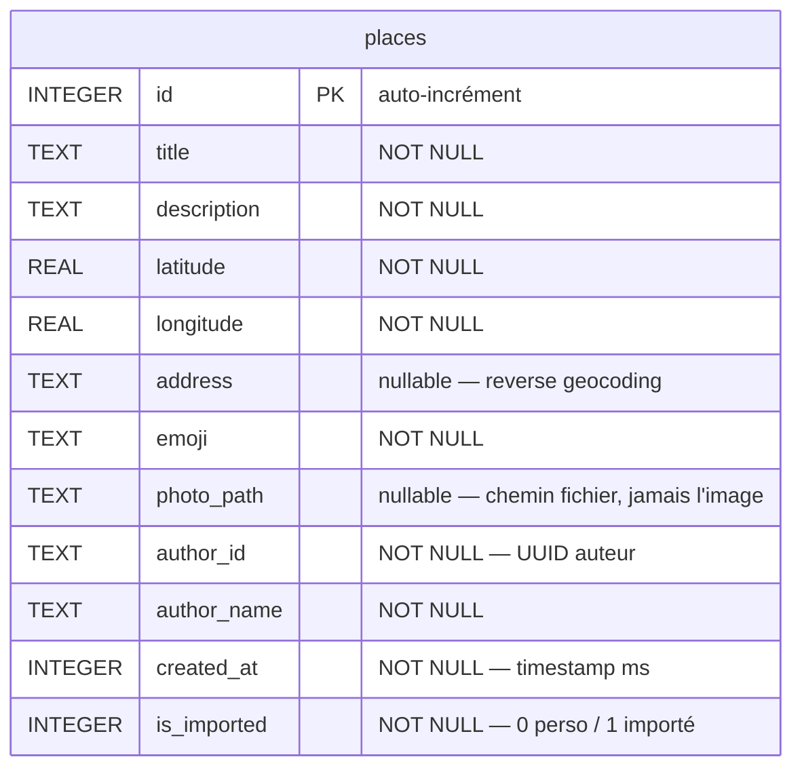

# My Place

> **Journal intime géographique** — épinglez les lieux qui comptent sur une carte, enrichissez-les d'une photo, d'une description et d'un émoji, puis partagez votre journal avec vos amis.

Application Android native. Projet de groupe étudiant.

---

## ✨ Fonctionnalités

| # | Fonctionnalité | Détail |
|---|---|---|
| 1 | **Carte & exploration** | Google Maps plein écran, centrée sur la position de l'utilisateur. Marqueurs personnalisés avec émoji. Clic sur un marqueur → fiche détail (`ModalBottomSheet`). |
| 2 | **Enregistrer un souvenir** | Appui long sur la carte ou bouton « Ajouter ici ». Formulaire : titre, description, émoji, photo (caméra CameraX **ou** galerie). L'adresse postale est remplie automatiquement par géocodage inversé. |
| 3 | **Persistance locale** | Base **Room** (SQLite). Les photos sont enregistrées comme fichiers dans le stockage privé de l'app — jamais en base. |
| 4 | **Import / Export JSON** | Exportez votre journal dans un fichier `.json` (photos incluses, encodées en Base64) et partagez-le via le menu Android. À l'import : fusion **sans doublon**. |
| 5 | **Sécurité biométrique** | Verrouillage optionnel de l'app par empreinte digitale ou code PIN / schéma du téléphone. |

---

## 🛠️ Stack technique

| Domaine | Technologie |
|---|---|
| Langage | Kotlin |
| UI | Jetpack Compose + Material 3 |
| Architecture | MVVM — injection de dépendances manuelle via `AppContainer` (sans Hilt) |
| Base de données | Room (SQLite), compilateur **KSP** |
| Réseau | Retrofit + Gson → [`api-adresse.data.gouv.fr`](https://adresse.data.gouv.fr/api-doc/adresse) (reverse geocoding) |
| Carte | Google Maps SDK + Maps Compose |
| Photo | CameraX (capture) + Coil (affichage) |
| Sécurité | AndroidX Biometric (`BiometricPrompt`) |
| Préférences | DataStore Preferences |
| Permissions | Accompanist Permissions |

- **Min SDK** 26 (Android 8.0) · **Target SDK** 35
- **Gradle** 9.5 · **AGP** 9.2.1 · **Kotlin** 2.2.10

---

## 🏗️ Architecture

MVVM en couches, avec des dépendances à **sens unique** :

```
UI (Compose)  →  ViewModel  →  Repository  →  Sources de données
 MapScreen…       MapViewModel…  PlaceRepository   Room · Retrofit · DataStore
```

- L'**UI** affiche un état et transmet les événements ; elle ne touche jamais aux données directement.
- Le **ViewModel** porte l'état de l'écran et la logique, dans des coroutines qui survivent à la rotation.
- Le **Repository** est la source unique de vérité : le seul à parler à la fois à Room et à l'API.
- Les **données remontent** automatiquement via des `Flow` / `StateFlow` : insérer un lieu suffit à rafraîchir la carte.

`AppContainer` (créé une fois dans `MyPlacesApplication`) instancie et relie toutes les couches.

📖 Détail complet : [`doc/ARCHITECTURE_MYPLACES.md`](doc/ARCHITECTURE_MYPLACES.md) · Roadmap : [`doc/PLAN_DEVELOPPEMENT.md`](doc/PLAN_DEVELOPPEMENT.md)

### Structure des packages

```
app/src/main/java/com/myplaces/app/
├── MyPlacesApplication.kt      instancie AppContainer
├── MainActivity.kt             Activity unique + verrou biométrique + NavHost
├── di/
│   └── AppContainer.kt         Room + Retrofit + Repository + DataStore
├── data/
│   ├── local/                  Room : PlaceEntity, PlaceDao, AppDatabase
│   ├── remote/                 Retrofit : GeocodingApiService, GeocodingResponse
│   └── repository/             PlaceRepository
├── ui/
│   ├── navigation/             Screen (routes) + NavGraph
│   ├── map/ addplace/ camera/ settings/ biometric/ components/ theme/
└── util/                       FileUtils, JsonExporter, JsonImporter, BiometricHelper, UserPreferences
```

---

## 🗄️ Base de données

SQLite via Room. **Une seule table**, `places` — aucune relation, aucune clé étrangère.



| Colonne | Type | NULL | Rôle |
|---|---|:---:|---|
| `id` | INTEGER PK | non | Clé primaire auto-incrémentée |
| `title` / `description` | TEXT | non | Titre, description |
| `latitude` / `longitude` | REAL | non | Coordonnées GPS |
| `address` | TEXT | oui | Adresse postale (géocodage inversé), `null` si hors France |
| `emoji` | TEXT | non | Émoji du marqueur |
| `photo_path` | TEXT | oui | Chemin du fichier photo interne — **jamais l'image en base** |
| `author_id` / `author_name` | TEXT | non | Identité de l'auteur (dénormalisée, pas de table `users`) |
| `created_at` | INTEGER | non | `System.currentTimeMillis()` |
| `is_imported` | INTEGER | non | `0` = lieu personnel · `1` = importé d'un ami |

```sql
CREATE TABLE `places` (
  `id` INTEGER PRIMARY KEY AUTOINCREMENT NOT NULL,
  `title` TEXT NOT NULL, `description` TEXT NOT NULL,
  `latitude` REAL NOT NULL, `longitude` REAL NOT NULL,
  `address` TEXT, `emoji` TEXT NOT NULL, `photo_path` TEXT,
  `author_id` TEXT NOT NULL, `author_name` TEXT NOT NULL,
  `created_at` INTEGER NOT NULL, `is_imported` INTEGER NOT NULL
);
```

Fichier physique : `/data/data/com.myplaces.app/databases/myplaces_database`. Version `1`, sans migration.

---

## 🚀 Démarrage

### Prérequis

- Android Studio (2024.1+) avec un JDK 21
- Une **clé API Google Maps** (sinon la carte reste vide)

### Configuration

Créer / compléter le fichier `local.properties` à la racine (non versionné) :

```properties
sdk.dir=C:\\Users\\<vous>\\AppData\\Local\\Android\\Sdk
MAPS_API_KEY=VOTRE_CLE_API_GOOGLE_MAPS
```

Pour obtenir la clé : [Google Cloud Console](https://console.cloud.google.com/) → activer **Maps SDK for Android** → créer une clé API → la restreindre au package `com.myplaces.app` et au SHA‑1 du keystore de debug.

### Build & exécution

```bash
./gradlew assembleDebug     # génère app/build/outputs/apk/debug/app-debug.apk
./gradlew installDebug      # installe sur un appareil / émulateur connecté
```

Ou ouvrir le projet dans Android Studio et lancer **Run ▶**.

> 💡 GPS et caméra fonctionnent mal sur émulateur : préférer un appareil physique (Android 8.0+).

---

## 📄 Format d'échange JSON

Fichier `places_export.json` produit par l'export :

```json
{
  "export_version": 1,
  "author_id": "550e8400-e29b-41d4-a716-446655440000",
  "author_name": "Antoine",
  "exported_at": "2026-06-25T10:00:00Z",
  "places": [
    {
      "title": "Mon café préféré",
      "description": "Le meilleur espresso de Paris",
      "latitude": 48.8566,
      "longitude": 2.3522,
      "address": "12 Rue de Rivoli 75001 Paris",
      "emoji": "☕",
      "created_at": 1750849200000,
      "author_id": "550e8400-e29b-41d4-a716-446655440000",
      "author_name": "Antoine",
      "image_base64": "/9j/4AAQSkZJRg... (JPEG en Base64, ou null)"
    }
  ]
}
```

À l'import, un lieu est **ignoré** si un lieu de même `author_id` **et** même `created_at` existe déjà (clé d'unicité fonctionnelle). Les lieux importés sont marqués `is_imported = 1`.

---

## ⚠️ Limitations connues

- Le géocodage inversé ne couvre que la **France** (`api-adresse.data.gouv.fr`) ; hors de France, l'adresse reste vide (le lieu est quand même créé).
- Le verrouillage biométrique s'applique **au lancement** de l'app, pas à chaque retour d'arrière‑plan.
- Pas de tests automatisés.

---

## 👥 Équipe

Projet de groupe — Antonin, Clément, Najwa.
